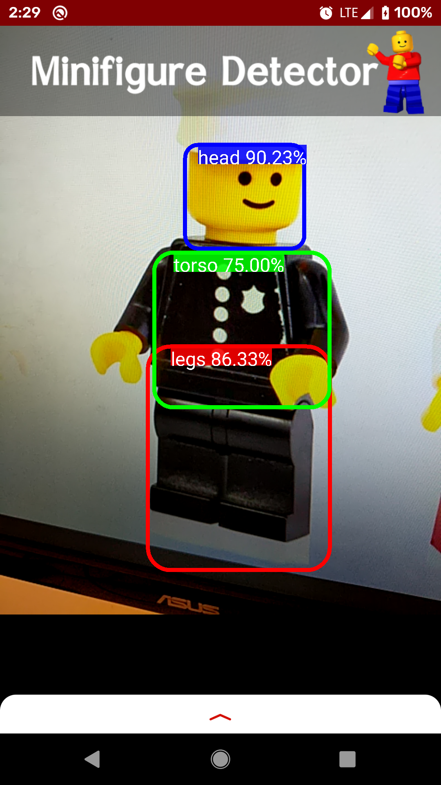
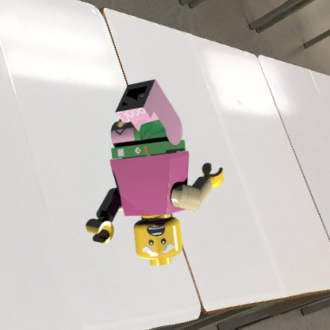
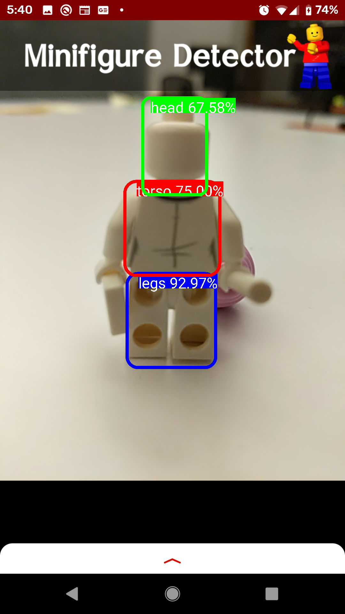

# leggo_my_legs

Leggo my Legs is an android app that detects Lego minifigures utilizing a neural network. I used transfer learning to adjust the model to our training data.



## Training Data Generation

Training data was generated synthetically from 3d models following these steps:

1. Use MLCad's minifig generator to create 1000 randomly configured minifigures in LDraw format. QuickMacros was used to automate this process. The code for the QuickMacros script is in src/model_gen.qm
2. Use LDView's command line conversion feature to convert the LDraw files to POVRay format. The following python code was used to compensate for the lack of a built-in batch processing option.
    ```
    models = os.listdir(models_path)
    for model in models:
        cmd = f'{LDView_path} "{models_path}{model}" -ExportFile="{pov_path}{model[:-4]}.pov"'
        !$cmd
    ```
3. Use the scripts in src/datagen_functions.py to modify and render the POVRay files. These scripts remove the floor so that it can use the alpha channel as a mask, randomizes the camera direction (uniformly distributed over the sphere), makes four renders and processes them to generate bounding boxes for the legs, torso, head, and headwear, and places them on random backgrounds.
    ```
    metadata = run_datagen_rounds(povray_files_path, output_path)
    metadata.to_csv(output_path)
    ```

Here is an example of our data:



Training data was augmented by official Lego photos of every minifigure from (need to check date) to present.

## Model Training

We trained our YOLOv3 model using the tools in this excellent repo: https://github.com/david8862/keras-YOLOv3-model-set

The classes were swapped out for our five (legs, torso, head, headwear, complete_minifigure) and the model was trained (on an AWS p2.xlarge overnight)/(for X epochs after X warmup epochs).

```
Plot of loss during training here!!!
Plot of learning rate during training here!!!
```

After training, the model was converted into the tensoflow-lite (.tflite) format for sidtribution in mobile apps.

## Mobile App

We used a Tensorflow app template for our android app that can be found at this repo: 

